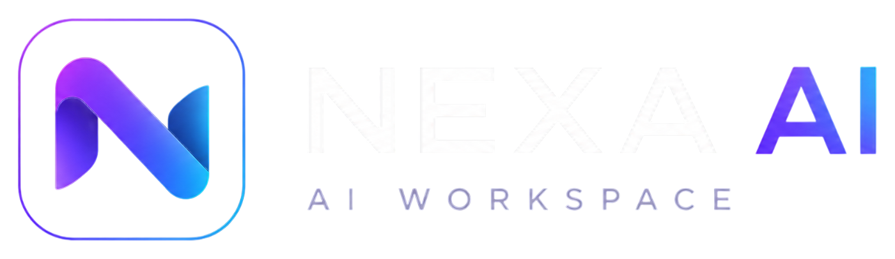

<p align="center">
  Language: <a href="README.md">English</a> | <a href="README.vi.md">Tiếng Việt</a>
</p>

<p align="center">
  
</p>

<h1 align="center">Nexa AI Workspace</h1>

<p align="center">
  A self-hosted multi-provider AI chatbot workspace with encrypted BYOK provider settings, document-aware chat, memory, and a polished web interface.
</p>

<p align="center">
  
  
  
  
  
  
</p>

---

## Overview

Nexa AI Workspace is an AI chatbot web project built around a simple idea: keep the chat experience clean while letting users bring their own model providers and credentials.

The backend is a Flask application that handles authentication, sessions, provider connections, conversations, uploads, document retrieval, memory, storage quotas, and rate limiting. The frontend includes a React/Vite landing experience plus a server-rendered chat workspace with modular JavaScript for streaming, markdown, citations, uploads, provider settings, and conversation management.

This repository currently contains:

| Area | What is implemented |
| --- | --- |
| Chat app | Flask-rendered authenticated workspace with conversation history and streaming support |
| Landing app | React/Vite marketing/landing surface served from `chatbot-dashboard/dist` when built |
| Providers | Saved provider connections, encrypted API keys, model detection, activation, and custom base URLs |
| Documents | Upload, chunk, embed, search, cite, and delete PDF/DOCX/TXT/Markdown documents |
| Memory | Personalization profile, manual memories, explicit-memory capture, and automatic memory hooks |
| Security | Firebase auth sessions, CSRF checks, origin validation, rate limiting, upload limits, and provider URL validation |

---

## Key Features

### Multi-Provider AI Routing

- Bring-your-own-key provider setup with encrypted server-side credential storage.
- Supported provider definitions for OpenAI, OpenRouter, Anthropic Claude, Google Gemini, Kimi/Moonshot, Groq, DeepSeek, Together AI, Mistral, Cohere, Fireworks AI, Perplexity, xAI Grok, Ollama, LM Studio, and OpenAI-compatible/custom endpoints.
- Model detection and connection testing when the provider supports it.
- Active provider/model switching from the chat workspace.
- Environment-based fallback configuration for Gemini, OpenAI, and OpenRouter.

### Chat Workspace

- Authenticated chat page with saved conversations and message history.
- Standard JSON chat endpoint and streaming NDJSON endpoint.
- Conversation create, rename, delete, clear, import, and feedback routes.
- Markdown and KaTeX rendering on the frontend.
- Response citations when document retrieval contributes context.
- Theme preference, auto-scroll preference, mobile sidebar behavior, and long-conversation "load earlier" rendering.

### Uploads, Documents, and RAG

- Upload support for `pdf`, `docx`, `txt`, `md`, and common image formats.
- Text extraction for PDF and DOCX files.
- Document storage with chunking, embeddings, retrieval, and citation metadata.
- Local hash embeddings by default, with OpenAI-compatible embeddings available through environment configuration.
- Document search, source file serving, storage usage reporting, and document deletion.

### Memory and Personalization

- User personalization text stored per account.
- Manual memory CRUD endpoints.
- Explicit memory capture from chat messages.
- Automatic memory hooks with configurable memory limits.
- Conversation summaries used as part of context building.

### Security and Operational Guardrails

- Firebase ID token verification with server-side session creation.
- Configurable public sign-in, verified-email requirement, allowed email domains, and allowed email addresses.
- CSRF protection for state-changing routes.
- Same-origin validation for unsafe requests.
- Flask-Limiter rate limits with Redis required in production.
- Upload size limits, image size limits, per-user storage quotas, conversation quotas, memory quotas, and provider connection quotas.
- Custom provider base URL validation with protections against unsafe metadata/link-local targets.
- PostgreSQL required for production mode; SQLite supported for local development.

---

## Screenshots

The repository already includes a few visual assets that can be used in the README:

| Preview | Asset |
| --- | --- |
| Landing preview | `chatbot-dashboard/public/assets/Landing.png` |
| Normal state | `chatbot-dashboard/public/assets/Normal.png` |
| Hover/detail state | `chatbot-dashboard/public/assets/Hover.png` |

Recommended GitHub screenshots to add later:

- `docs/screenshots/landing.png`
- `docs/screenshots/chat-workspace.png`
- `docs/screenshots/provider-settings.png`
- `docs/screenshots/documents-and-citations.png`

---

## Tech Stack

### Backend

| Technology | Purpose |
| --- | --- |
| Flask 3 | Web app, API routes, server-rendered chat pages |
| SQLAlchemy 2 | ORM models and persistence |
| Alembic | Database migrations |
| Firebase Admin SDK | Firebase token verification |
| Flask-Limiter | Per-user/IP rate limiting |
| Redis | Production rate-limit backend |
| Cryptography/Fernet | Provider API key encryption |
| pypdf / python-docx | Document text extraction |
| Gunicorn | Production WSGI server |
| pytest | Backend and frontend-behavior tests |

### Frontend

| Technology | Purpose |
| --- | --- |
| React 18 | Landing/dashboard UI |
| Vite 6 | Frontend build tooling |
| Tailwind CSS | Landing app styling |
| Framer Motion / Motion | Animation primitives |
| Three.js / React Three Fiber | Landing visual effects |
| Firebase Web SDK | Browser authentication flow |
| Vanilla JS modules | Chat workspace behavior |
| KaTeX | Math rendering in chat |

### Data and Storage

| Storage | Usage |
| --- | --- |
| SQLite | Local development database |
| PostgreSQL | Required database for production mode |
| Local filesystem | Uploaded document/image source storage |
| Redis | Production rate limiting |

---

## Architecture

```text
User
  |
  v
React/Vite landing app
  |
  v
Flask app
  |-- Auth routes: Firebase session, login, register, logout
  |-- Chat routes: JSON chat, streaming chat, RAG context, memory hooks
  |-- Provider routes: model detection, testing, encrypted saved connections
  |-- Conversation routes: history, import, rename, delete, feedback
  |-- Document routes: upload, chunk, embed, search, cite, delete
  |-- Memory routes: personalization and user memory CRUD
  |-- Health routes: /health and /ready
  |
  v
SQLAlchemy models
  |-- users
  |-- conversations / messages / attachments
  |-- provider_connections
  |-- user_personalizations / user_memories
  |-- documents / document_chunks
  |-- audit_logs
  |
  v
AI provider adapters
  |-- Anthropic
  |-- Cohere
  |-- Gemini
  |-- OpenAI-compatible providers
```

---

## Project Structure

```text
.
|-- chatbot-dashboard/          # React/Vite landing app
|   |-- public/assets/          # Existing preview/logo assets
|   |-- src/components/         # Landing sections, layout, and UI components
|   |-- src/data/landingData.js # Landing content and provider-facing copy
|   |-- package.json
|   `-- vite.config.js
|
|-- chatbot-simple/             # Flask chatbot application
|   |-- app.py                  # App factory, blueprint registration, runtime entry
|   |-- routes/                 # Auth, chat, provider, document, memory, health routes
|   |-- services/               # Config, auth, persistence, security, AI, RAG, uploads
|   |-- static/                 # Chat CSS/JS, Firebase auth JS, KaTeX vendor assets
|   |-- templates/              # Landing fallback, login/register, chat workspace
|   |-- migrations/             # Alembic migration scripts
|   |-- tests/                  # pytest test suite
|   |-- .env.example            # Environment variable template
|   `-- requirements.txt
|
|-- image/                      # Additional copied visual assets
|-- CHANGELOG.md
|-- storage-quota-roadmap.md
`-- README.md
```

---

## Setup

### 1. Clone the repository

```bash
git clone https://github.com/your-username/your-repo-name.git
cd your-repo-name
```

### 2. Configure the backend

```bash
cd chatbot-simple
python -m venv venv

# Windows PowerShell
.\venv\Scripts\Activate.ps1

# macOS/Linux
source venv/bin/activate

pip install -r requirements.txt
copy .env.example .env
```

On macOS/Linux, use `cp .env.example .env` instead of `copy`.

### 3. Configure the frontend landing app

```bash
cd ../chatbot-dashboard
npm install
npm run build
```

When `chatbot-dashboard/dist/index.html` exists, the Flask landing route serves the built React app. Without a build, Flask falls back to `chatbot-simple/templates/landing.html`.

---

## Environment Variables

Start from [`chatbot-simple/.env.example`](chatbot-simple/.env.example). The most important variables are:

| Variable | Required | Purpose |
| --- | --- | --- |
| `APP_ENV` | Yes | `development` or `production` |
| `SECRET_KEY` | Production | Flask session secret |
| `DATABASE_URL` | Production | SQLite locally, PostgreSQL in production |
| `PROVIDER_CREDENTIAL_KEY` | Production | Dedicated Fernet secret for saved provider API keys |
| `VITE_FIREBASE_*` | Production | Firebase web configuration for browser auth |
| `FIREBASE_CREDENTIALS_JSON` / `FIREBASE_CREDENTIALS` / `GOOGLE_APPLICATION_CREDENTIALS` | Production | Firebase Admin credentials |
| `AUTH_ALLOW_PUBLIC_SIGNIN` | Recommended | Whether arbitrary Firebase users can sign in |
| `AUTH_ALLOWED_EMAIL_DOMAINS` / `AUTH_ALLOWED_EMAILS` | Production when public sign-in is false | Access allowlist |
| `RATE_LIMIT_BACKEND` | Yes | `memory` locally, `redis` in production |
| `REDIS_URL` | Production | Redis URL for rate limiting |
| `UPLOAD_STORAGE_DIR` | Optional | Local upload/document storage path |
| `MAX_UPLOAD_MB` | Optional | Per-file upload limit |
| `MAX_UPLOAD_STORAGE_MB_PER_USER` | Optional | Per-user upload storage quota |
| `RAG_ENABLED` | Optional | Enable/disable document retrieval |
| `EMBEDDING_PROVIDER` | Optional | `local` by default, `openai`/OpenAI-compatible supported |
| `EMBEDDING_API_KEY` | Required for remote embeddings | Embedding provider credential |
| `AI_REQUEST_TIMEOUT` | Optional | Provider request timeout |
| `AI_MAX_OUTPUT_TOKENS` | Optional | Max output token setting passed to providers |

Provider fallback variables are also supported for environment-configured Gemini, OpenAI, and OpenRouter connections:

```env
GEMINI_API_KEY=
GEMINI_MODEL=gemini-2.5-flash

OPENAI_API_KEY=
OPENAI_MODEL=
OPENAI_BASE_URL=https://api.openai.com/v1

OPENROUTER_API_KEY=
OPENROUTER_MODEL=
OPENROUTER_BASE_URL=https://openrouter.ai/api/v1
```

Production mode validates configuration at startup. In production, use PostgreSQL, Redis-backed rate limiting, non-default secrets, Firebase Admin credentials, and an explicit auth access policy unless public sign-in is intentional.

---

## Run Locally

### Backend and chat app

```bash
cd chatbot-simple
.\venv\Scripts\Activate.ps1
python app.py
```

The Flask app runs on:

```text
http://127.0.0.1:5000
```

Useful routes:

| Route | Purpose |
| --- | --- |
| `/` | Landing page |
| `/login` | Firebase login page |
| `/register` | Firebase register page |
| `/chat` | Authenticated chat workspace |
| `/health` | Basic health check |
| `/ready` | Database readiness check |

### Frontend landing app in development mode

```bash
cd chatbot-dashboard
npm run dev
```

Vite serves the landing app separately for frontend development. Build it with `npm run build` when you want Flask to serve the compiled version.

### Database migrations

For local SQLite development, the app creates missing tables on startup and also includes migration scripts. To run migrations explicitly:

```bash
cd chatbot-simple
alembic upgrade head
```

---

## Testing

Run the Python test suite from the Flask app directory:

```bash
cd chatbot-simple

# Windows PowerShell
$env:PYTHONPATH='.'; pytest

# macOS/Linux
PYTHONPATH=. pytest
```

The current tests cover areas including:

- Firebase Admin auth behavior
- Provider routing and provider configuration
- Security controls
- User isolation
- Uploads and streaming behavior
- Conversation summaries and context building
- Memory and personalization behavior
- RAG document handling and citations
- Storage quota MVP behavior
- Frontend markdown/citation rendering behavior

For the React landing app:

```bash
cd chatbot-dashboard
npm run build
```

There is no dedicated frontend test script in `chatbot-dashboard/package.json` at the moment.

---

## Deployment Notes

### Backend

The backend can run behind a WSGI server such as Gunicorn:

```bash
cd chatbot-simple
gunicorn app:app
```

For hosted production deployments, configure:

- `APP_ENV=production`
- PostgreSQL `DATABASE_URL`
- Redis `REDIS_URL`
- `RATE_LIMIT_BACKEND=redis`
- Non-default `SECRET_KEY`
- Dedicated `PROVIDER_CREDENTIAL_KEY`
- Firebase web config and Firebase Admin credentials
- `AUTH_ALLOWED_EMAIL_DOMAINS`, `AUTH_ALLOWED_EMAILS`, or intentional `AUTH_ALLOW_PUBLIC_SIGNIN=true`

The app exposes `/health` and `/ready` for platform checks.

### Frontend

Build the landing app before deployment:

```bash
cd chatbot-dashboard
npm install
npm run build
```

The Flask app serves the built landing bundle from `chatbot-dashboard/dist`. If deploying the landing app separately, point its auth/workspace actions back to the Flask backend.

### Storage

Uploaded files are currently stored on local disk under `UPLOAD_STORAGE_DIR`. That is straightforward for local demos and single-instance deployments, but a persistent shared object store would be a better fit for multi-instance hosting.

---

## Security and Privacy Notes

- User provider API keys are encrypted before being stored and masked when returned to the browser.
- The browser sends Firebase ID tokens to the backend, where the server creates its own session.
- Access can be restricted by verified email, allowed domains, or allowed individual emails.
- CSRF tokens are required on state-changing routes when `CSRF_ENABLED=true`.
- Unsafe requests are checked against the current request origin.
- Production rate limiting requires Redis so limits survive restarts and coordinate across workers.
- Uploaded document source files are stored locally and can be retrieved only through authenticated user-scoped routes.
- RAG embeddings are local hash embeddings by default. If remote embeddings are enabled, document text is sent to the configured embedding provider.
- Local uploaded-file storage is not a substitute for durable object storage in distributed production deployments.

---

## Current Limitations

- The repository is licensed under the MIT License.
- The landing app has a build script but no dedicated frontend test script.
- Uploaded files use local filesystem storage.
- The storage roadmap mentions trash, archive, and richer storage breakdown ideas that are not fully implemented.
- Multi-user team workspaces, shared provider management, billing, and organization-level controls are not present.

---

## Roadmap

- Add committed GitHub screenshots for the landing page, chat workspace, provider settings, and document citation flow.
- Keep license and project metadata current.
- Add frontend tests for the React landing app and critical chat UI modules.
- Add cloud/object storage support for uploaded documents and images.
- Add richer document management: trash, restore, archive, sorting, and storage breakdown views.
- Improve onboarding for first-time Firebase and provider setup.
- Add team or organization workspace concepts if the project grows in that direction.
- Add deployment examples for specific platforms such as Render, Railway, Fly.io, or VPS setups.

---

## Credits

Built by **Vu Duc Quang** as an AI chatbot workspace project.

The project uses open-source tools across the Flask, React, Firebase, SQLAlchemy, Alembic, KaTeX, and Vite ecosystems.
